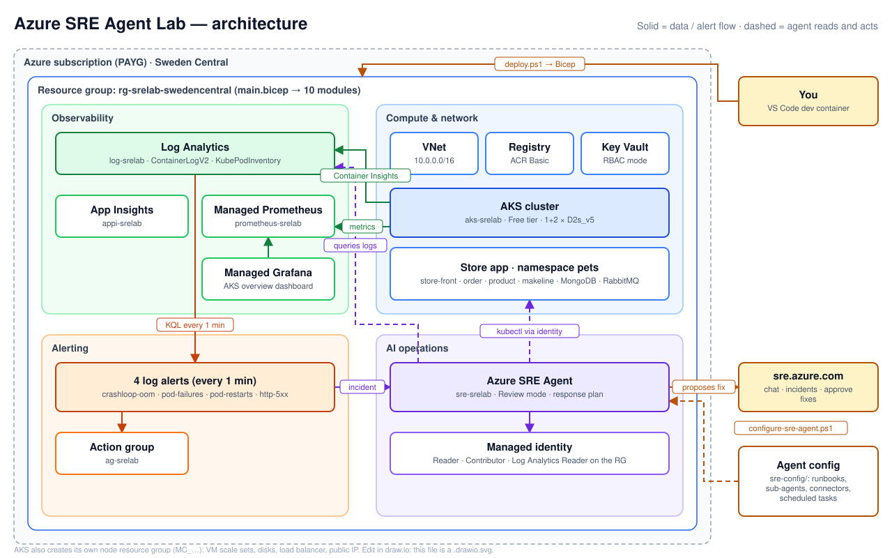

# Azure SRE Agent Lab — Architecture, Scripts & Cost Control Guide

*Charlie Salameh · September 2026 · Sweden Central, low-cost profile*

This guide explains how the lab fits together — every Bicep module, every script, the SRE Agent itself — and how to keep its token (AAU) spend under control.

**Diagrams** (in [`docs/diagrams/`](diagrams/)):

- [`architecture.drawio.svg`](diagrams/architecture.drawio.svg) — renders on GitHub **and** opens for editing in [draw.io](https://app.diagrams.net) or the VS Code *Draw.io Integration* extension. A plain [`architecture.drawio`](diagrams/architecture.drawio) copy is included too.
- [`incident-flow.svg`](diagrams/incident-flow.svg) — animated: follow the incident from break to fix.

---

## 1. The big picture

The lab is three layers deployed in order: **Bicep** builds the Azure infrastructure, **kubectl** puts the store app on AKS, and **PowerShell + REST calls** configure the SRE Agent's brain (knowledge, sub-agents, connectors, tasks). One command, `deploy.ps1`, runs all three.



How an incident flows at runtime: a pod fails → Container Insights writes to Log Analytics → a one-minute log alert fires → the Azure Monitor connector hands it to the SRE Agent → its incident response plan runs the `incident-handler` sub-agent → it reads memory and runbooks, queries logs and the cluster, and proposes a fix that waits for your approval (Review mode).



| Layer | Where in the repo | Tool | What to read first |
| --- | --- | --- | --- |
| Infrastructure | `infra/bicep/` | Bicep (ARM) | `main.bicep`, then `modules/` |
| Application | `k8s/base/`, `k8s/scenarios/` | kubectl | `application.yaml` |
| Agent configuration | `sre-config/` | PowerShell + REST | `agents/*.yaml`, `knowledge-base/` |
| Automation | `scripts/` | PowerShell | `deploy.ps1`, `configure-sre-agent.ps1` |
| Dev environment | `.devcontainer/` | Docker | `post-create.sh` (aliases) |

## 2. Bicep: what gets created

`main.bicep` runs at **subscription scope**: it creates the resource group `rg-<workload>-<region>`, then calls ten modules into it. Names come from one `names` map in `main.bicep`; a `uniqueSuffix` (hash of the subscription) makes ACR, Key Vault and Grafana names globally unique. Feature flags in `main.bicepparam` switch whole modules on or off: `deploySreAgent`, `deployObservability`, `deployAlerts`, `deployActionGroup`.

| Module (`modules/`) | Azure resources | Name in the lab | Why it exists |
| --- | --- | --- | --- |
| `network.bicep` | VNet with `snet-aks` (10.0.0.0/22) and `snet-services` (10.0.4.0/24) | `vnet-srelab` | Azure CNI puts pod IPs in the AKS subnet |
| `log-analytics.bicep` | Log Analytics workspace (30-day retention, no daily cap) + ContainerInsights solution | `log-srelab` | Where container logs, events and pod inventory land; what alerts and the agent query |
| `app-insights.bicep` | Workspace-based Application Insights (90-day retention) | `appi-srelab` | Agent's own telemetry and app traces |
| `container-registry.bicep` | ACR Basic | `acrsrelab<suffix>` | Image registry (the app pulls public `ghcr.io` images) |
| `aks.bicep` | AKS (2 pools, Azure CNI + Calico, OIDC, workload identity, Azure Policy + Key Vault CSI add-ons), AcrPull role, Container Insights DCR + association | `aks-srelab` | The workload the agent watches; **public API server required** for the agent |
| `key-vault.bicep` | Key Vault, RBAC mode, 7-day soft delete | `kv-srelab-<suffix>` | Secrets store; why `destroy.ps1` purges it |
| `sre-agent.bicep` | User-assigned managed identity, 3 role assignments, `Microsoft.App/agents`, SRE Agent Administrator for the deployer | `sre-srelab` | The AI agent itself (section 5) |
| `observability.bicep` | Azure Monitor workspace (Managed Prometheus), DCE + DCR + associations, Managed Grafana Standard, 3 role assignments | `prometheus-srelab`, `grafana-srelab-<suffix>` | Metrics and dashboards |
| `action-group.bicep` | Action group (optional webhook) | `ag-srelab` | Where alerts are routed |
| `alerts.bicep` | 4 scheduled log query alerts, each every 1 minute | `alert-srelab-*` | Pod restarts, HTTP 5xx, failed/pending pods, CrashLoop/OOM |

Total from the what-if: **32 resources**. AKS also creates its own node resource group `MC_rg-srelab-..._aks-srelab_<region>` (VM scale sets, disks, load balancer, public IP); it is deleted with the cluster.

**Low-cost changes** live in `main.bicepparam`: `systemNodeCount = 1`, `userNodeCount = 2`, `aksSkuTier = 'Free'`, `systemNodeMaxCount = 2`, `userNodeMaxCount = 3`. `main.bicep` keeps the upstream defaults, so removing those lines restores the original sizing.

**Verify it yourself** (after a deploy):

```powershell
az resource list -g rg-srelab-swedencentral --query "[].{type:type, name:name}" -o table
az aks show -g rg-srelab-swedencentral -n aks-srelab --query "{tier:sku.tier, pools:agentPoolProfiles[].{name:name,count:count,max:maxCount,size:vmSize}}" -o json
az role assignment list -g rg-srelab-swedencentral --query "[].{role:roleDefinitionName, who:principalName}" -o table
az deployment sub what-if -l swedencentral -f infra/bicep/main.bicep -p infra/bicep/main.bicepparam -p location=swedencentral
```

The last line is the same dry run `deploy.ps1 -WhatIf` performs — the safest way to see what any Bicep change will do.

## 3. The scripts

`deploy.ps1` is the orchestrator: it checks prerequisites, runs the Bicep deployment, then calls the other scripts in order. Everything else can also be run on its own.

**What `deploy.ps1` does, in order**

1. Checks Azure CLI, Bicep, login, subscription and that `Microsoft.App/agents` is available (registers `Microsoft.App` if needed).
2. Runs `az deployment sub what-if` (with `-WhatIf`, stops here) or `az deployment sub create` with `main.bicep` + `main.bicepparam`.
3. Handles a Key Vault name left in soft-delete from an earlier run.
4. Runs `configure-rbac.ps1` (extra roles Bicep can't always assign; skip with `-SkipRbac`).
5. `az aks get-credentials`, then `kubectl apply -f k8s/base/application.yaml`, and waits for the store-front public IP.
6. Runs `validate-deployment.ps1`, `configure-grafana.ps1`, then `configure-sre-agent.ps1` and `verify-sre-agent-configuration.ps1`.
7. Runs `verify-telemetry.ps1` (waits until Container Insights data is in Log Analytics) and prints the summary box.

| Script | What it does | When you run it |
| --- | --- | --- |
| `deploy.ps1` | Everything above | `-Location swedencentral -Yes`; `-WhatIf` for a dry run; `-SkipSreAgent` for infra only |
| `destroy.ps1` | Deletes the resource group, waits, purges the Key Vault, removes the kubectl context | Always pass `-ResourceGroupName rg-srelab-swedencentral` (default is eastus2) |
| `configure-sre-agent.ps1` | 6 steps on the agent's REST API: knowledge base, custom agents, connectors, incident response plan, scheduled tasks, summary | After changing `sre-config/`; `-SkipScheduledTasks`, `-SkipConnectors`, `-SkipAgents`, `-SkipKnowledgeBase` |
| `configure-sre-agent-v2.ps1` | Wrapper forwarding to the script above | Ignore; kept for old commands |
| `configure-rbac.ps1` | Extra roles for the agent identity on AKS, Key Vault, ACR, Log Analytics | Only if Bicep role assignments were blocked |
| `configure-grafana.ps1` | Uploads the AKS overview dashboard; `-Cleanup` removes it | After deploy (automatic) |
| `manage-azure-monitor-profile.ps1` | Reports or removes the 4 alerts + action group | To stop alerts without destroying the lab |
| `validate-deployment.ps1` | Resources provisioned, AKS reachable, pods running, endpoints assigned | Any time |
| `verify-sre-agent-configuration.ps1` | The 18 configuration checks | After deploy or reconfigure |
| `verify-telemetry.ps1` | Confirms `ContainerLogV2` and `KubePodInventory` rows exist | When the agent says it has no data |
| `run-demo-scenario.ps1` | Baseline → break → verify → restore → JSON/Markdown evidence report | Repeatable demos |
| `report-sre-agent-capabilities.ps1` | Read-only report of what the agent can and cannot do | Governance review |
| `probe-incident-filter-api.ps1` | Test harness for the incident-filter API | Not needed normally |
| `yaml-to-agent-json.py`, `yaml-to-api-json.py` | Convert `sre-config/agents/*.yaml` to API JSON | Used by the configure script |
| `validate-sre-agent-governance.py` | Checks `sre-config/governance/review-profile.yaml` | Optional |

**How `configure-sre-agent.ps1` talks to the agent:** it gets a token with `az account get-access-token --resource https://azuresre.dev` and calls the agent endpoint (`https://sre-srelab--<id>.<region>.azuresre.ai`) on `/api/v2/extendedAgent/...` (agents, connectors, scheduledTasks, incident filters) and `/api/v1/AgentMemory/files` (knowledge base) — which is why `*.azuresre.ai` must be reachable.

**Dev container shortcuts** (`.devcontainer/post-create.sh`): `menu`, `deploy`, `destroy`, `site`, `sre-agent`, `kgp`/`kgs`/`kgd`, `break-*` (each is `kubectl apply -f k8s/scenarios/<name>.yaml`), `fix-all` (`kubectl apply -f k8s/base/application.yaml`), `fix-network`, `fix-extras`.

## 4. The Kubernetes layer

`k8s/base/application.yaml` is the healthy baseline: the AKS Store Demo in namespace `pets`. Every break scenario overwrites one piece of it; `fix-all` re-applies the baseline.

| Component | Replicas | Role | Talks to |
| --- | --- | --- | --- |
| `store-front` | 2 | Public web shop (LoadBalancer) | order-service :3000, product-service :3002 |
| `store-admin` | 1 | Admin UI (LoadBalancer) | product, makeline |
| `order-service` | 2 | Order API | RabbitMQ queue `orders` |
| `product-service` | 2 | Product API | references `ai-service:5001` (not deployed) |
| `makeline-service` | 2 | Processes orders | RabbitMQ → MongoDB |
| `virtual-customer` | 1 | Generates traffic | store-front |
| `mongodb` | 1 | Order database (8 GiB disk) | — |
| `rabbitmq` | 1 | Message queue | — |

| Scenario (`k8s/scenarios/`) | Shortcut | What breaks | Correct diagnosis |
| --- | --- | --- | --- |
| `oom-killed.yaml` | `break-oom` | order-service memory limit far too low | OOMKilled, exit 137 → raise limit or roll back |
| `crash-loop.yaml` | `break-crash` | product-service exits on startup | CrashLoopBackOff, exit code in logs |
| `image-pull-backoff.yaml` | `break-image` | makeline-service points to a missing image | Image pull failure |
| `high-cpu.yaml` | `break-cpu` | Stress pod burns CPU | Resource contention |
| `pending-pods.yaml` | `break-pending` | Pods request 8 CPU / 32 GiB | Unschedulable |
| `probe-failure.yaml` | `break-probe` | Liveness probe always fails | Pod killed by probe |
| `network-block.yaml` | `break-network` | NetworkPolicy blocks order-service | Connectivity (`fix-network`) |
| `missing-config.yaml` | `break-config` | Missing ConfigMap | CreateContainerConfigError |
| `mongodb-down.yaml` | `break-mongodb` | MongoDB scaled to 0 | Cascading failure, root = database |
| `service-mismatch.yaml` | `break-service` | Service selector doesn't match pods | Silent failure, empty endpoints |

Scenarios that add objects need `fix-extras` or `fix-network` as well as `fix-all`. With the low-cost profile the user pool caps at 3 nodes, so `break-pending` stays Pending instead of scaling out.

## 5. Understanding the SRE Agent

The SRE Agent is an Azure resource (`Microsoft.App/agents`) running a large language model with a set of tools, acting through a managed identity you control. Three layers: **what it can reach** (identity + roles), **what it knows** (knowledge base + memory), **what it does on its own** (sub-agents, response plans, scheduled tasks).

### 5.1 Identity and permissions

- Bicep creates a user-assigned managed identity and gives it, on the resource group only: **Reader**, **Log Analytics Reader** and **Contributor** (`accessLevel: 'High'`, *Privileged* in the portal). `accessLevel: 'Low'` drops Contributor.
- The agent uses that identity for `knowledgeGraphConfiguration` (resources it maps — the AKS cluster) and `actionConfiguration` (what it acts with).
- The deployer gets **SRE Agent Administrator** on the agent (chat, configure, approve).
- Nothing outside the resource group is reachable unless you grant more.

### 5.2 Modes

- **Review** (this lab): investigates freely with read tools; any write (restart, scale, rollback) is proposed and waits for approval.
- **Autonomous**: applies fixes itself — only with a narrow scope and low access level.
- Every tool call is labelled *Safe* or *Medium/High risk*.

> **The gap:** Review mode gates changes to your *resources*. It does **not** gate the agent creating scheduled tasks, running investigations or spending units.

### 5.3 What it knows

- **Knowledge base** (`sre-config/knowledge-base/`, 6 runbooks) uploaded to agent memory.
- **Its own memory** written during onboarding: `architecture.md`, `overview.md`, `logs.md`, `debugging.md`, `team.md`, `preferences.md`, with facts tagged `[verified]` / `[unreachable]`. Read first in every incident.
- **Connected data**: Azure resources, Logs (Log Analytics + App Insights via `system-mcp-monitor`), Incidents (Azure Monitor). Code (GitHub) optional.

### 5.4 Sub-agents (`sre-config/agents/`)

| Sub-agent | Job | Key tools | Used by |
| --- | --- | --- | --- |
| `incident-handler` (core) | Investigate alerts with runbooks, logs, metrics | SearchMemory, RunAzCliRead/**Write**Commands, QueryLogAnalytics, QueryAppInsights, ExecutePythonCode, SendOutlookEmail | Incident response plan |
| `incident-handler` (full) | Same + GitHub issues | + `github-mcp/*` | Only with a GitHub PAT |
| `cluster-health-monitor` | Proactive health reports | Read tools + SendOutlookEmail | Scheduled tasks |
| `code-analyzer` | Source-code root cause | Read/write CLI + `github-mcp/*` | Optional |

`SendOutlookEmail` is why an unauthorised Outlook connector causes errors — remove the tool if you don't use Outlook.

### 5.5 Connectors

| Connector | Purpose | Notes |
| --- | --- | --- |
| `azure-monitor` | Receives alerts as incidents | Required |
| `microsoft-learn` | Documentation lookups (MCP) | Optional |
| `outlook` | Lets agents send email | Needs Microsoft 365 consent; fails with a personal account |
| `github-mcp` | Code search, issues | Optional |

### 5.6 What runs without you

- **Incident response plan** `aks-pod-failure-handler`: filters Azure Monitor alerts (high severity, `pets`) and hands matches to `incident-handler` in Review mode. Each matching alert = one paid investigation.
- **Scheduled tasks** from `configure-sre-agent.ps1` (all use `cluster-health-monitor`):

| Task | Cron (UTC) | Runs/day |
| --- | --- | --- |
| `daily-health-check` | `0 8 * * *` | 1 |
| `daily-rbac-cost-network-audit` | `30 8 * * *` | 1 |
| `hourly-automation-health` | `0 * * * *` | 24 |

- **Tasks the agent creates for itself** (e.g. an every-minute monitor, up to 1,440 runs/day) — visible under **Automation**, not covered by the approval gate.

### 5.7 Where to look in the portal

**Builder → Agent Canvas** (sub-agents, routing) · **Incidents → Triggers & response plans** · **Automation** (all tasks, including the agent's own) · **Settings → Basics** (model, access level, mode, Stop) · **Settings → Managed resources** · **Settings → Agent consumption** · **View trace** on any thread.

## 6. Controlling token (AAU) spend

The most effective control is the **monthly active flow limit**: **Settings → Agent consumption → Change AAU allocation**, anywhere from **500 to 1,000,000 AAU** (default seen in this lab: 10,000). At the limit the agent is unavailable for chat and actions until next month ([Microsoft Learn](https://learn.microsoft.com/en-us/azure/sre-agent/monitor-agent-usage)).

### 6.1 How billing works

- **Always-on flow:** 4 AAU/hour per agent while it **exists**, even stopped. Waived for the 30-day evaluation. Only deletion stops it.
- **Active flow:** tokens while the agent works, per million tokens, model-dependent. Thread types: **Chats**, **Incidents**, **Scheduled tasks**, **Triggers**.
- **Model choice:** e.g. Claude Opus 4.6 = 100 AAU / 1M input tokens, GPT 5.3 Codex = 35 ([pricing](https://learn.microsoft.com/en-us/azure/sre-agent/pricing-billing)).

**Lab numbers (session 2):** 288 AAU — scheduled tasks 192 (67%), incidents 50, chats 46, triggers 1. The OOM diagnosis itself: **13 AAU**; the agent's self-created every-minute task: **151 AAU**. Whole two-day experiment: about **$15**.

### 6.2 Guardrails

| # | Control | Where | What it stops |
| --- | --- | --- | --- |
| 1 | Monthly active flow limit (e.g. 1,000 AAU for a lab) | Settings → Agent consumption | Any runaway spend |
| 2 | Review **Automation** after every session | Automation | Self-created tasks |
| 3 | `configure-sre-agent.ps1 -SkipScheduledTasks`, or make `hourly-automation-health` daily | `scripts/configure-sre-agent.ps1` Step 5 | 24 idle runs/day |
| 4 | Add to sub-agent `system_prompt`: "Never create scheduled tasks or recurring monitors; ask the user instead." | `sre-config/agents/*.yaml` | One-off requests turning into recurring jobs |
| 5 | Narrow the incident response plan (severity, service) | Incidents → Triggers & response plans | Investigations of noise |
| 6 | Pause alerts when not testing: `manage-azure-monitor-profile.ps1 -Cleanup -ConfirmCleanup` | Azure Monitor | Alert-triggered investigations |
| 7 | Choose the model deliberately; compare AAU per investigation | Settings → Basics | Top-tier rates for simple checks |
| 8 | **Stop agent** between sessions | Settings → Basics | Active flow (always-on continues) |
| 9 | Delete the agent / `destroy.ps1` when done | Portal / script | Always-on charges |

### 6.3 Watch it

- **Agent consumption** page (donut by thread type, daily bars, per-thread table, CSV export) at the end of every session.
- **Azure Cost Management** budget on the subscription; optionally one filtered to the agent resource.
- Give anything the agent schedules an **owner and an expiry** by policy (control 4) and enforce it with the limit (control 1).

## 7. Checklist: review the repo yourself

- [ ] `infra/bicep/main.bicep` top to bottom: parameters, `names`, resource group, each `module` and its `if (...)` flag
- [ ] `modules/sre-agent.bicep`: the three role IDs, `accessLevel`, `mode: 'Review'`
- [ ] `modules/aks.bicep`: node pools, `enablePrivateCluster: false`, add-ons, Container Insights DCR
- [ ] `modules/alerts.bicep`: the 4 KQL queries that wake the agent
- [ ] `./scripts/deploy.ps1 -Location swedencentral -WhatIf` after any Bicep change
- [ ] `scripts/deploy.ps1` from ~line 480: the step order in section 3
- [ ] `scripts/configure-sre-agent.ps1` Steps 1–5: uploads and the 3 scheduled tasks
- [ ] `sre-config/agents/incident-handler-core.yaml`: `system_prompt` and `tools`
- [ ] One runbook in `sre-config/knowledge-base/` (e.g. `aks-pod-failures.md`)
- [ ] Next deploy: set the monthly AAU limit **before** testing; check **Automation** and **Agent consumption** at the end

## Sources

- [Monitor agent usage in Azure SRE Agent — Microsoft Learn](https://learn.microsoft.com/en-us/azure/sre-agent/monitor-agent-usage)
- [Pricing and billing for Azure SRE Agent — Microsoft Learn](https://learn.microsoft.com/en-us/azure/sre-agent/pricing-billing)
- [Supported regions — Microsoft Learn](https://learn.microsoft.com/en-us/azure/sre-agent/supported-regions)
- Based on [matthansen0/azure-sre-agent-sandbox](https://github.com/matthansen0/azure-sre-agent-sandbox) (MIT)
